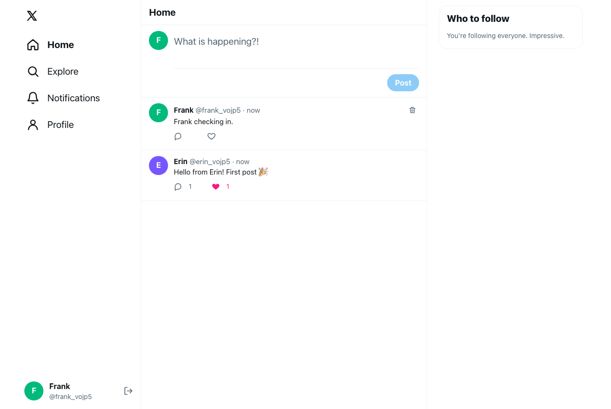
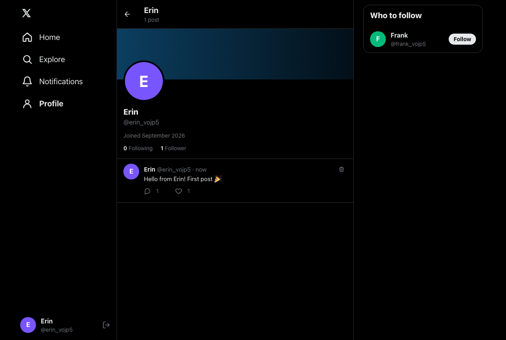

# Social — an X/Twitter-style app

Register, post (280 chars), follow people, get a timeline of the people you follow, like and reply to posts, browse profiles, and get live notifications when someone likes, replies to or follows you.

| Feed (light) | Profile (dark) |
| --- | --- |
|  |  |

## Tech stack

| Layer | Tech |
| --- | --- |
| Backend | Python 3.12, FastAPI, SQLAlchemy 2 (async) + asyncpg, Alembic, Pydantic v2 |
| Auth | JWT (python-jose) in an httpOnly cookie, bcrypt password hashing (passlib) |
| Real-time | WebSocket (Starlette) for like / reply / follow notifications |
| Database | PostgreSQL 16 (Neon in production) |
| Frontend | Next.js 15 (App Router), TypeScript, Tailwind CSS v4, TanStack Query v5 |
| Infra | Docker Compose locally; Render (API) + Vercel (web) + Neon (DB) in production |

## Run it locally (Docker)

```bash
cp .env.example .env        # then replace POSTGRES_PASSWORD and SECRET_KEY
docker compose up --build
```

- App: http://localhost:3000
- API docs (Swagger): http://localhost:8000/docs

Migrations run automatically when the backend container starts. If ports 3000/8000 are taken, set `FRONTEND_PORT` / `BACKEND_PORT` in `.env`.

## Run it locally (without Docker)

Requires Python 3.12, Node 22+, and a running PostgreSQL.

```bash
# Backend
cd backend
python3.12 -m venv .venv && source .venv/bin/activate
pip install -r requirements-dev.txt
cp .env.example .env        # point DATABASE_URL at your database, set SECRET_KEY
createdb social
alembic upgrade head
uvicorn app.main:app --reload --port 8000

# Frontend (second terminal)
cd frontend
npm install
npm run dev                 # http://localhost:3000, proxies /api to http://localhost:8000
```

Set `BACKEND_URL` / `NEXT_PUBLIC_WS_URL` in `frontend/.env.local` if the backend is not on `localhost:8000`.

## Tests

```bash
cd backend
createdb social_test
TEST_DATABASE_URL=postgresql+asyncpg://USER@localhost:5432/social_test pytest
```

CI (`.github/workflows/ci.yml`) runs on every push to `main` and on pull requests. The backend job runs migrations up, `alembic check` and down, then pytest against Postgres 16. The frontend job runs ESLint and `next build`, which includes type-checking.

## How it fits together

```
Browser ──/api/*──▶ Next.js (rewrite proxy) ──▶ FastAPI ──▶ PostgreSQL
   └─────── WebSocket (short-lived token) ──────▶ FastAPI /ws/notifications
```

- **Same-origin API.** The browser only calls `/api/*` on the frontend's own domain, and Next.js rewrites those requests to the backend. The auth cookie is therefore first-party, which matters because browsers block third-party cookies between `*.vercel.app` and `*.onrender.com`. The cookie is `httpOnly` and `SameSite=Lax`, plus `Secure` in production.
- **WebSocket auth.** Vercel can't proxy WebSockets, so the browser connects straight to the backend. It first fetches a 2-minute, WebSocket-only token from `GET /api/auth/ws-token`; that token can't be used as a login cookie.
- **Feed query.** `user_id = me OR user_id IN (SELECT following_id FROM follows WHERE follower_id = me)`, newest first, using offset/limit. Like counts, reply counts and `liked_by_me` are computed in the same query, so there's no N+1. The index on `(user_id, created_at)` serves it.

## API

Interactive docs are at `/docs` on the backend. Errors are always JSON: `{"detail": "..."}`. Validation errors (422) also include `errors`.

| Method | Path | Auth | Notes |
| --- | --- | --- | --- |
| POST | `/api/auth/register` | – | `{email, username, password, display_name?}` → 201 + cookie |
| POST | `/api/auth/login` | – | `{email, password}` → 200 + cookie |
| POST | `/api/auth/logout` | – | clears cookie |
| GET | `/api/auth/me` | ✓ | current user |
| GET | `/api/auth/ws-token` | ✓ | short-lived WebSocket token |
| POST | `/api/posts` | ✓ | `{content}` (1–280 chars) → 201 |
| GET | `/api/feed?page&limit` | ✓ | self + followed users |
| GET | `/api/explore?page&limit` | – | everyone's posts |
| GET | `/api/posts/:id` | – | post + replies |
| DELETE | `/api/posts/:id` | owner | 204, or 403 for non-owners |
| POST | `/api/posts/:id/like` | ✓ | toggle: 201 liked / 200 unliked |
| POST | `/api/posts/:id/replies` | ✓ | `{content}` → 201 |
| GET | `/api/users/:username` | – | profile, counts, last 10 posts |
| GET | `/api/users/:username/followers` | – | paginated |
| GET | `/api/users/:username/following` | – | paginated |
| GET | `/api/suggestions` | ✓ | who to follow |
| POST | `/api/follows/:username` | ✓ | 201 (idempotent); 400 on self-follow |
| DELETE | `/api/follows/:username` | ✓ | 204 (idempotent) |
| WS | `/ws/notifications?token=` | token | `{type, actor_username, actor_display_name, post_id}` |

## Production Deployment

The production stack is deployed as a Vercel frontend, Render API, and Neon PostgreSQL database:

| Service | Production URL / setting |
| --- | --- |
| Frontend | <https://frontend-ten-dun-h6h74enh9u.vercel.app> |
| Backend | <https://social-backend-btsu.onrender.com> |
| Database | Neon project `social-app`, branch `production` |
| GitHub repository | <https://github.com/Turyabasa/my-social-app> |

The Render service is named `social-backend`, uses Python 3.12.14, and runs from `backend/`. Its build command is `pip install -r requirements.txt`; its start command runs `alembic upgrade head` before Uvicorn. The health check is `/api/health`. These settings are also described in [`render.yaml`](render.yaml).

Set these environment variables in Render. Do not commit real values or paste credentials into documentation:

| Variable | Purpose |
| --- | --- |
| `ENVIRONMENT` | `production` |
| `DATABASE_URL` | Neon PostgreSQL connection URL |
| `SECRET_KEY` | Long random signing secret; generate it in Render |
| `CORS_ORIGINS` | `https://frontend-ten-dun-h6h74enh9u.vercel.app` |
| `COOKIE_SECURE` | `true` |
| `COOKIE_SAMESITE` | `lax` |
| `PYTHON_VERSION` | `3.12.14` |

The Vercel project is `social-app2/frontend`, deployed from `frontend/`. Its production environment variables are:

```text
BACKEND_URL=https://social-backend-btsu.onrender.com
NEXT_PUBLIC_WS_URL=wss://social-backend-btsu.onrender.com
```

Both are read at build time, so redeploy Vercel after changing them. Deployment Protection is disabled on the Vercel project so the site is public. The app itself redirects signed-out visits to `/` to `/login`; the login and explore pages remain available.

### Continuous Deployment

`.github/workflows/ci.yml` runs backend migrations/tests and frontend lint/build on pull requests and pushes to `main`. Only a successful push to `main` runs the production deploy job. It builds and deploys the frontend with the Vercel CLI. Render uses its native `checksPass` auto-deploy trigger, so it deploys the linked commit only after GitHub checks pass. Sync this setting to the existing Render service if it is not managed by the Blueprint yet.

Add these repository secrets under **Settings → Secrets and variables → Actions** before merging changes that should deploy:

| Secret | Value |
| --- | --- |
| `VERCEL_TOKEN` | A Vercel access token with access to the `social-app2` team/project |

Never put the token in the workflow, README, or repository variables. GitHub Actions uses the production environment name `production`; configure protection rules there if deploy approvals are desired.

Verify the live services:

```bash
curl https://social-backend-btsu.onrender.com/api/health
curl 'https://social-backend-btsu.onrender.com/api/explore?page=1&limit=100'
```

Free-tier caveats:
- Render's free instance can spin down after inactivity, delaying the first request by 50 seconds or more; open WebSockets may disconnect and reconnect.
- Notifications are held in backend memory and therefore require a single running instance. Multiple instances need Redis or PostgreSQL `LISTEN/NOTIFY`.

## Production Sample Data

The production database currently contains 100 demo accounts (`demo_seed_0001` through `demo_seed_0100`, with `@example.com` email addresses) and 100 sample posts tagged `#DemoData`. Each demo account has a random password hash whose original password was discarded, so these accounts are not usable for sign-in. The public explore API can display the posts. Avoid reseeding the same namespace or assigning passwords to these accounts.

Local `.env` files are git-ignored. Keep Neon connection strings, JWT signing secrets, and other credentials in ignored local env files or the provider dashboards; rotate any credential that is exposed.

## Project layout

```
backend/   FastAPI app (app/), Alembic migrations, tests
frontend/  Next.js app (src/app pages, src/components, src/hooks, src/lib)
docker-compose.yml, render.yaml, .github/workflows/ci.yml
```
